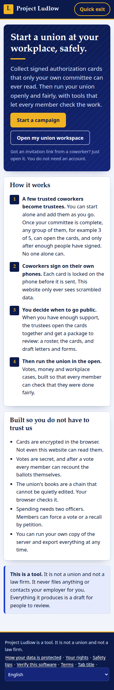
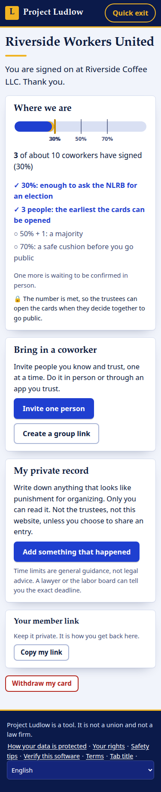
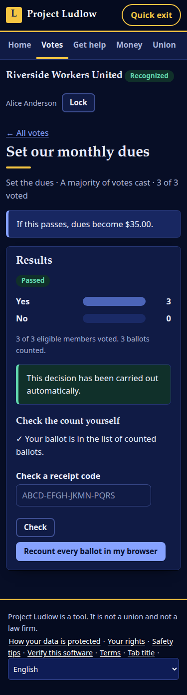

# Project Ludlow

**A union nobody can silence, and nobody has to trust.**

[](https://github.com/ChrisRyanWill/project-ludlow/actions/workflows/ci.yml)

> **Status: early prototype.** It has not been independently security-reviewed or legally reviewed. Please don't use it for real organizing yet; [help us get it there](CONTRIBUTING.md).

[**Live page**](https://chrisryanwill.github.io/project-ludlow/) · [Contributing](CONTRIBUTING.md) · [Threat model](docs/THREAT_MODEL.md) · [Protocol](docs/PROTOCOL.md) · [Discussions](https://github.com/ChrisRyanWill/project-ludlow/discussions) · [Security policy](SECURITY.md)

<p>
  
  
  
</p>

Project Ludlow is an open-source platform that takes a group of workers from "we should organize" to "we run our own union", in two halves:

1. **Organize.** Coworkers sign electronic authorization cards on their own phones. Each card is encrypted *in the browser* with a key split among a few trusted trustees, so the server only ever holds ciphertext and, once the committee is complete, **no one person can read a card**: it takes `k` of `n` trustees together. (Honest caveats: until the founder has confirmed the committee, the founder holds the only key; a signer's browser checks the trustees' keys against the founder's key check in their invitation, so it trusts the founder and whoever gave them the link; and the same protection for the workspace's grievance and vote keys is not built yet. See the [threat model](docs/THREAT_MODEL.md).) Cards from group links only count once a coworker confirms the signer in person. When the committee decides to go public, the browser builds the filing package locally: roster, cards, declaration, letters, worksheets.
2. **Run.** Once the union is public it gets a workspace with secret-ballot votes, workplace cases, money, rules and deadlines, all built so that **every member can check the work**, not just trust the officers.

> Nothing here files anything, contacts an employer, or talks to an agency. It prepares drafts for people. Every legal text carries `DRAFT — REQUIRES REVIEW BY A LICENSED LABOR ATTORNEY`.

## Try it

```bash
npm install
npm start          # builds the web app, serves http://localhost:8787   (Node 20+)
npm test           # unit + API tests, and a real-Chromium run through the whole product
```

Data lives in `./data/ludlow.db` (one SQLite file). In development the confirmation emails go to an in-memory outbox at `/dev/outbox`. You can also try the core idea, sealing a card among trustees, on the [live page](https://chrisryanwill.github.io/project-ludlow/#try) without installing anything.

**A five-minute walkthrough** (use a phone-sized window; open links in private windows to play different people):
1. `Start a campaign`, pick the release number (try 3 people), and make your key. **You can invite people right away; nobody else has to join first.**
2. On your dashboard: `Invite one person`, then `Create a group link`. Sign cards from those links in other windows.
3. Confirm the group-link signers with their two-word codes. Watch the progress bar, the 30/50/70% markers and the gold lock marker. Try `Unlock and export` before the number is met: it is refused.
4. In `Your committee`, get an invite link for each other trustee and let them join. Ask each one to read you their key words, tick the ones that match, then `Confirm the committee and lock the early cards`. Now `Unlock and export` with two trustees' key files: the cards open **locally**; download the ZIP.
5. Tick "we have already gone public" to create the workspace. Claim accounts, hold a secret-ballot vote, recount it yourself, then open a case as a worker.

## What is built (all of it is tested)

| Area | What you get |
|---|---|
| **Zero-knowledge cards** | Per-card keys split k-of-n (Shamir), sealed to each trustee; XChaCha20-Poly1305; Argon2id key files; challenge-response auth; no passwords, no cookies; everything secret lives in URL fragments; server stores only hashes and ciphertext. **One person can start alone**: the campaign is live as soon as the founder has a key, early cards are sealed to the founder, and when the committee has joined one button re-locks them k-of-n. |
| **An enforced release lock** | Set when you create the campaign ("keep the cards sealed until at least N people have signed"). The server refuses to hand over the sealed cards until that many are signed *and* confirmed, so even all the trustees together have nothing to decrypt early. Raising it is free; lowering it takes k trustees. Signers and members can see the number. |
| **Legal by design** | Cards carry every field NLRB GC 15-08 requires; a Confirmation Transmission is emailed (and then forgotten); disavow link; declaration, demand letter, petition worksheet generated from templates. The letter **refuses to claim a majority** the numbers do not show. |
| **Any country** | *Jurisdiction packs* make the legal layer data: US (NLRA), UK (CAC), and a general pack where trustees enter their local threshold. Adding a country is content, not code. |
| **Retaliation shield** | Each signer keeps a private, encrypted record of anything that looks like punishment for organizing (with a filing-deadline clock), and can share one entry with the committee, sealed to every trustee and unlinked from their card. |
| **Verifiable democracy** | Secret ballots stored with no voter reference or timestamp (and re-shuffled on every cast, so the order is not left on disk); the committee counts in a browser; a decision that changes dues, rules or roles is always counted in the open and carries itself out; **any member can recount** the published ballots and check their receipt (that shows the numbers match the stored ballots, not that none were swapped); concurrent double votes are impossible. |
| **Bylaws that execute themselves** | A vote that passes *changes reality*: dues, rule changes, removing an officer from a role. Members can force a vote or a recall by petition. Spending needs two officers; nobody approves their own request. |
| **Every member is an auditor** | The ledger and audit log are hash chains. Each browser re-checks the chain and remembers the newest entry it saw, so rewritten history is caught. Ledger rows cannot be edited even by SQL (triggers). |
| **Fair representation, enforced** | A case cannot close without a decision, a reason, and telling the worker. Grievance content is end-to-end encrypted. Deadlines (business days, holidays, time zones) are computed for you. Help is never gated by dues. |
| **Safety** | Quick exit button and triple-Esc, neutral tab titles on private pages, QR-code invites (nothing sent, so no message trail), software fingerprint check, read-aloud, English and Spanish, works on cheap phones (no framework; strict CSP; nothing third-party, verified by a test that watches every network request). |
| **The union owns its data** | One-click full export (officers, audit-logged), one SQLite file, a `Dockerfile` (built and run in production mode to verify it), no lock-in. |
| **Verifiable software** | Builds are **reproducible**: a local build and the Docker build produce byte-identical `app.js`, so anyone can rebuild from source and compare the SHA-256 with what the site shows on `/verify`. |

**Look and feel:** a union-hall masthead rather than a generic app: navy banner, rich ultramarine, gold highlights, serif headlines (system fonts only, nothing loaded from anywhere), a double-ruled authorization card, and a dark theme that follows the phone's setting. The whole palette is a handful of CSS variables at the top of `web/style.css`.

Protocol details are in [`docs/PROTOCOL.md`](docs/PROTOCOL.md); the honest threat model is in [`docs/THREAT_MODEL.md`](docs/THREAT_MODEL.md).

## Research that shaped it

The parts of the law that had moved were checked against primary sources (as of September 2026):

- **NLRB GC Memo 15-08 (Revised, 26 Oct 2015)**, read at the source ([PDF](http://www.opeiu-local2.org/uploads/4/3/3/5/43355477/nlrb_memo_on_electronic_authorization_cards.pdf)): confirms the six required card fields, the declaration, the Confirmation Transmission (and that responses must go to the NLRB), and that dates of birth and SSNs must not be included. A "website set up by the organizers plus a Confirmation Transmission" is the memo's own worked example, which is the design here.
- **Cemex is unsettled.** The Sixth Circuit rejected the NLRB's 2023 *Cemex* standard on 6 Mar 2026 ([*Brown-Forman*](https://www.beneschlaw.com/insight/brown-forman-decision-rolls-back-nlrbs-pro-union-cemex-policy/)); the Ninth Circuit upheld a bargaining order on older *Gissel* grounds ([summary](https://www.laborrelationsupdate.com/2026/04/cemex-status-quo-ninth-circuit-declines-to-address-nlrbs-cemex-standard/)); a Board revisit is expected. So the US letter template *requests* voluntary recognition and does not assert a legal duty.
- **UK recognition got easier on 6 Apr 2026** (Employment Rights Act 2025): no more "likely majority" test, no 40% ballot threshold, and a power to lower the 10% membership threshold toward 2% ([A&O Shearman](https://www.aoshearman.com/en/insights/ao-shearman-on-employment/lowering-the-bar-uk-union-recognition-gets-easier), [Farrer](https://www.farrer.co.uk/news-and-insights/employment-rights-act-2025-trade-union-recognition-and-access-rights-explained/)). That is why the UK is the second pack.

Law changes. Every threshold and deadline in `content/legal/` needs a qualified reviewer, and pull requests that change legal content must cite sources.

## How this differs from the original specs

The original build specifications are in [`docs/spec/`](docs/spec/) and double as the roadmap.

| The spec said | Built | Reason |
|---|---|---|
| Postgres, Drizzle, Hono, React, Tailwind, monorepo | SQLite, Node `http`, vanilla JS + esbuild, one repo | A working MVP with few dependencies and no build toolchain; a union can self-host one file. The schema ports to Postgres. |
| `script-src 'self'` | adds `'wasm-unsafe-eval'` | Lets libsodium's WebAssembly compile. It does **not** permit JS `eval`. |
| Magic-link + passkey accounts (V2) | key file + passphrase, challenge-response | No email in the login path means nothing the server (or an email provider) can reset, phish or subpoena. Passkeys would be a good addition. |
| Stripe Connect dues, LM data sheets, bargaining, contract library, mail-ballot officer elections, labor-management module | not built yet | Scope. Officer elections online stay behind `ONLINE_OFFICER_ELECTIONS` (off), API only. |
| TypeScript strict | JavaScript with checks in tests | Speed. A TypeScript migration would be a welcome contribution. |

## Before real-world use

- **Host the server where no trustee controls it**, or the release lock binds nothing (it is enforced by the server; see the threat model).
- **Read the [threat model](docs/THREAT_MODEL.md) first.** An [internal, AI-assisted security review](docs/reviews/2026-09-internal-review-1.md) found and fixed real problems and wrote down design-level limits (the biggest, a server that lies about which keys belong to whom, is now closed for cards and reports and still open for the workspace's grievance and vote keys). It is not an independent audit.
- **Have a labor attorney review everything in `content/legal/`.** Every `TODO(lawyer)` / `TODO(accountant)` is a real open question.
- Get an independent security review of `shared/crypto.js`, `server/`, and the deployment. Read the threat model first.
- Set `WORKSPACE_MASTER_KEY` and back it up. Set `EMAIL_PROVIDER=postmark` (tracking is disabled in code) and a monitored `CONFIRMATION_REPLY_TO` inbox. Run behind HTTPS with `TRUST_PROXY=1` (the number of reverse proxies in front, 1 for Caddy or nginx), and set `NODE_ENV=production` (`npm start` does not; without it and without `WORKSPACE_MASTER_KEY`, a server listening only on this machine writes a development master key next to the database, and one listening on any other address refuses to start). Run **one** instance (challenges and rate limits are in memory).
- The Spanish translation is a first draft and needs a native, legally aware review.

## Not built yet

Stripe dues checkout and the LM-2/3/4 data sheet, mail-ballot officer elections, bargaining and contract library, joint labor-management committees, hardship fund, meetings and minutes, surveys with small-group suppression, passkeys, workspace deletion with cooling-off, PDF form filling, offline mode, more languages and countries, an in-browser demo of the whole app, federation and solidarity funds. The architecture leaves room for each. See the [open issues](https://github.com/ChrisRyanWill/project-ludlow/issues).

## Community and contributing

Developers, security reviewers, labor attorneys and organizers, translators, designers and accessibility testers are all needed. Start with [CONTRIBUTING.md](CONTRIBUTING.md), pick a [good first issue](https://github.com/ChrisRyanWill/project-ludlow/labels/good%20first%20issue), or start a [discussion](https://github.com/ChrisRyanWill/project-ludlow/discussions). Please read the [Code of Conduct](CODE_OF_CONDUCT.md), and report vulnerabilities privately as described in [SECURITY.md](SECURITY.md).

## How this was built

Project Ludlow was developed with AI assistance (Claude Code) from written specifications. That is a reason for *more* scrutiny, not less: every line is open to review, the tests are the first line of defense, and independent human review of the cryptography and the legal text is the top priority.

## License

Project Ludlow is free software, licensed under the **GNU Affero General Public License, version 3** ([AGPL-3.0-only](LICENSE)). You may use, study, change and share it, and if you run a modified version as a network service you must offer its source to the people who use it. Copyright © 2026 Project Ludlow contributors.

## Configuration

| Variable | Default | Meaning |
|---|---|---|
| `PORT`, `HOST` | `8787`, `127.0.0.1` | Listen address (`HOST=0.0.0.0` in containers) |
| `DATABASE_PATH` | `data/ludlow.db` | SQLite file |
| `APP_BASE_URL` | `http://localhost:PORT` | Used in confirmation emails |
| `WORKSPACE_MASTER_KEY` | dev key file | 32 bytes, base64. **Required in production** and whenever `HOST` is not a loopback address. |
| `EMAIL_PROVIDER` | `dev` | `dev` (in-memory outbox) or `postmark` |
| `POSTMARK_SERVER_TOKEN`, `EMAIL_FROM`, `CONFIRMATION_REPLY_TO` | | Real email |
| `CAMPAIGN_INACTIVITY_DAYS` | `180` | Idle campaigns are hard-deleted |
| `GROUP_INVITE_TTL_HOURS`, `DIRECT_INVITE_TTL_DAYS` | `72`, `7` | Invite lifetimes |
| `ONLINE_OFFICER_ELECTIONS` | `false` | Needs attorney sign-off |
| `SESSION_IDLE_HOURS`, `SESSION_MAX_DAYS` | `12`, `30` | Workspace sessions |
| `RATE_STRICT_PER_MIN` | `90` | Sensitive-route limit per client per minute (a group signing on one Wi-Fi shares an IP) |
| `TRUST_PROXY` | `0` | How many reverse proxies sit in front (1 for Caddy or nginx). The client IP is then read from the end of `X-Forwarded-For` (rate limiting only) |
| `MIN_VOTE_HOURS` | `24` | The shortest a vote may stay open, so members have time to see it |
| `CONFIRMATIONS_PER_CAMPAIGN_PER_DAY` | `2000` | Caps the confirmation emails one campaign can make this server send |

## Layout

```
shared/    crypto, permissions matrix, deadline engine, hash-chain verification (browser + Node)
server/    router, SQLite schema, campaign API, workspace API, email, envelope encryption
web/       single-page app (vanilla JS), jurisdiction packs, export package builder
content/   legal drafts per jurisdiction (Markdown)
test/      unit, API (in-process), and browser end-to-end tests
site/      the public project page (GitHub Pages), including the "Try the lock" demo
docs/      PROTOCOL.md, THREAT_MODEL.md, spec/ (the original specifications)
.github/   CI, the Pages deploy, issue and pull request templates
```
